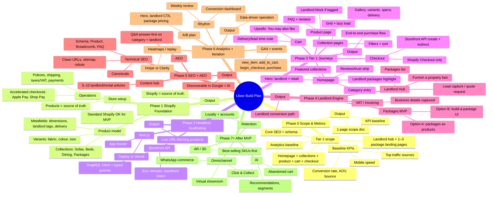

# Ubee Furniture — Headless Shopify + Next.js Build Plan (Mind Map)

Operator-grade build: launch-critical first, AR/AI later.

---

## Mermaid mind map (render in GitHub, VS Code, or [mermaid.live](https://mermaid.live))



---

## Outline view (same structure, copy-paste friendly)

```
Ubee Build Plan — Headless Shopify + Next.js
│
├── Phase 0 — Scope & success metrics (Day 1)
│   ├── Tier 1 scope (launch-critical only)
│   │   ├── Homepage + collections + product page + cart + checkout handoff
│   │   ├── Landlord hub page + 1–3 package landing pages
│   │   ├── Core SEO + schema
│   │   └── Analytics baseline
│   ├── Baseline metrics (even if rough)
│   │   ├── Conversion rate, AOV, bounce
│   │   ├── Top traffic sources
│   │   └── Mobile speed
│   └── Output: 1-page scope + KPI baseline
│
├── Phase 1 — Shopify foundation (Day 1–2)
│   ├── Store (standard Shopify OK for MVP)
│   ├── Product model
│   │   ├── Collections (Sofas, Beds, Dining, Packages)
│   │   ├── Variants (fabric, colour, size)
│   │   └── Metafields (dimensions, landlord tags, delivery)
│   ├── Policies + shipping + taxes/VAT + payments
│   ├── Accelerated checkouts (Apple Pay, Shop Pay)
│   └── Output: Shopify = source of truth
│
├── Phase 2 — Headless stack scaffolding (Day 2–3)
│   ├── Next.js (App Router)
│   ├── Storefront API
│   │   ├── Env: domain, storefront access token
│   │   └── GraphQL client + typed queries
│   ├── Deploy to Vercel (every milestone deployable)
│   └── Output: Live URL fetching products
│
├── Phase 3 — Tier 1 customer journeys (Day 3–7)
│   ├── Homepage
│   │   ├── Hero (landlord + retail)
│   │   ├── Category entry, landlord packages, trust strip
│   │   └── Featured collections
│   ├── Collection pages (filters, sort, grid, lazy load)
│   ├── Product page (gallery, variants, specs, delivery, landlord block, FAQ, reviews)
│   ├── Cart (upsells, delivery/lead time note)
│   ├── Checkout handoff (Shopify Checkout via Storefront API)
│   └── Output: End-to-end purchase flow
│
├── Phase 4 — Landlord engine (Week 2)
│   ├── Landlord Hub (value prop, packages list, lead/quote capture)
│   ├── Packages MVP
│   │   ├── Option A: packages as Shopify products
│   │   └── Option B: build-a-package UI → cart
│   ├── VAT invoice readiness (business details captured)
│   └── Output: Landlord conversion path
│
├── Phase 5 — SEO + AEO baseline (Week 2)
│   ├── Technical SEO (URLs, sitemap, robots, canonicals, Product/Breadcrumb/FAQ schema)
│   ├── AEO (Q&A answer-first on category + landlord pages)
│   ├── Content hub (5–10 landlord/rental articles)
│   └── Output: Discoverable in Google + AI
│
├── Phase 6 — Analytics + iteration (Week 2–3)
│   ├── GA4 + events (view_item, add_to_cart, begin_checkout, purchase)
│   ├── Heatmaps/session replay (Hotjar/Clarity)
│   ├── Conversion dashboard + weekly rhythm
│   ├── A/B plan (hero, landlord CTA, package pricing)
│   └── Output: Data-driven operation
│
└── Phase 7+ — After MVP is selling
    ├── AR / 3D (best-selling SKUs first)
    ├── AI (recommendations, segments, abandoned cart)
    ├── Omnichannel (Click & Collect, virtual showroom, WhatsApp)
    └── Loyalty + accounts (retention)
```

---

## Quick reference: outputs by phase

| Phase | Output |
|-------|--------|
| 0 | 1-page scope + KPI baseline (no feature sprawl) |
| 1 | Shopify = source of truth (products, inventory, checkout) |
| 2 | Live URL fetching products from Shopify |
| 3 | End-to-end purchase flow working |
| 4 | Landlord-specific conversion path |
| 5 | Discoverable in Google and AI answer engines |
| 6 | Not guessing — operating on data |
| 7+ | AR, AI, omnichannel, loyalty (only after MVP converts) |

---

*Render the Mermaid block in GitHub, VS Code (Mermaid extension), or paste into [mermaid.live](https://mermaid.live) to view the mind map.*
